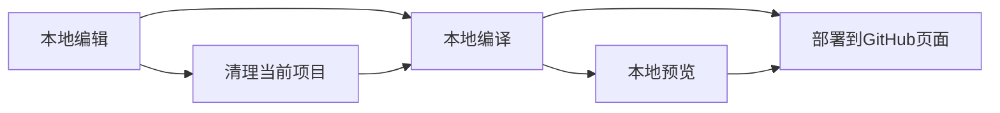

# 可提供一对多转烤推服务的bot后端v3
[](LICENSE)

## 简介

本仓库主要依赖于模块[tweepy](https://github.com/tweepy/tweepy)

将在未来增添更多bot接口支持

与CoolQ的通信依赖于CQHTTP以及模块[nonebot](https://github.com/nonebot/nonebot)，特别鸣谢[richardchien](https://github.com/richardchien)对nonebot封装项目的贡献。

**项目目前支持 Python 3.7 及 CQHTTP 插件 v4.8+**


## 文档

### 文档首页(使用者请使用)

[用户文档](https://chenxuan353.github.io/tweetTobot/)

# Docs分支

项目文档所在分支 通过Hexo部署。

### 文档维护(开发者请参见)

#### 依赖

本文档网站搭建使用[HEXO](https://hexo.io/)，当前页面搭建基于[NodeJS LTS](https://nodejs.org/en/download/)请安装Node.js 12以搭建开发环境。

#### 环境配置

##### 全局HEXO

推荐在全局安装HEXO以搭建其他页面

```
node i -g hexo
```

##### Plugins

进入`/docs`文件夹，在Shell内运行

```shell
npm i
```

安装依赖，并安装Git插件

```shell
npm i hexo-deployer-git --save
```

#### 使用

##### 添加新文档

```Shell
hexo new "<标题(建议英文)>"
```

或直接在`source/_post/`内添加Markdown文档(须仿照其他文档设置抬头)

##### 修改文档

略

##### 编译

hexo文档项目使用



的模式，故编译时建议先**清理本地静态页面**

```shell
npm run clean
```

或

```shell
hexo clean
```

然后进行**编译生成**

```shell
npm run generate
```

##### 部署

最后部署到GitHub

```shell
npm run deploy
```

之后网页便会自动Push到仓库的`gh-pages`分支，并自动部署到服务器。

